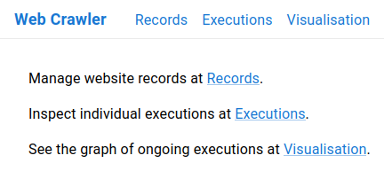
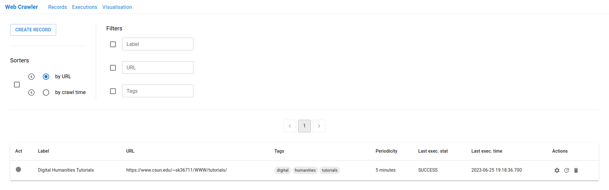
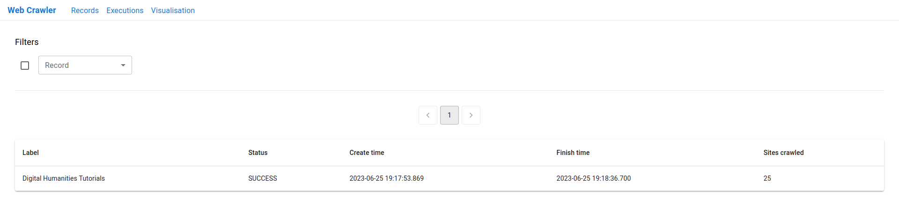
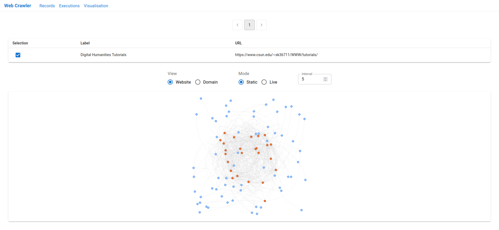

# web-crawler

An implementation[^1] of web crawler based on the [Specification](https://webik.ms.mff.cuni.cz/nswi153/seminar-project.html).

[^1]: This repository is a mirror of the original (archived) one located at https://gitlab.mff.cuni.cz/zhukovd/web-crawler.git.

## Deployment

Run the following commands to start up a self-contained instance of the crawler:

```bash
git clone https://github.com/zhukovdm/web-crawler.git
cd web-crawler/ && docker compose up
```

The application consists of four components.

| Component         | URL                           |
|-------------------|-------------------------------|
| React frontend    | http://localhost:3000         |
| OpenAPI backend   | http://localhost:3001         |
| GraphQL backend   | http://localhost:3002/graphql |
| MySQL database    | http://localhost:3306/        |

## Conceptual model


## User interface









## References

- https://react.dev/
- https://www.typescriptlang.org/docs/handbook/intro.html
- https://redux-toolkit.js.org/
- https://mui.com/material-ui/getting-started/
- https://github.com/visjs/vis-network
- https://graphql.org/learn/execution/#root-fields-resolvers
